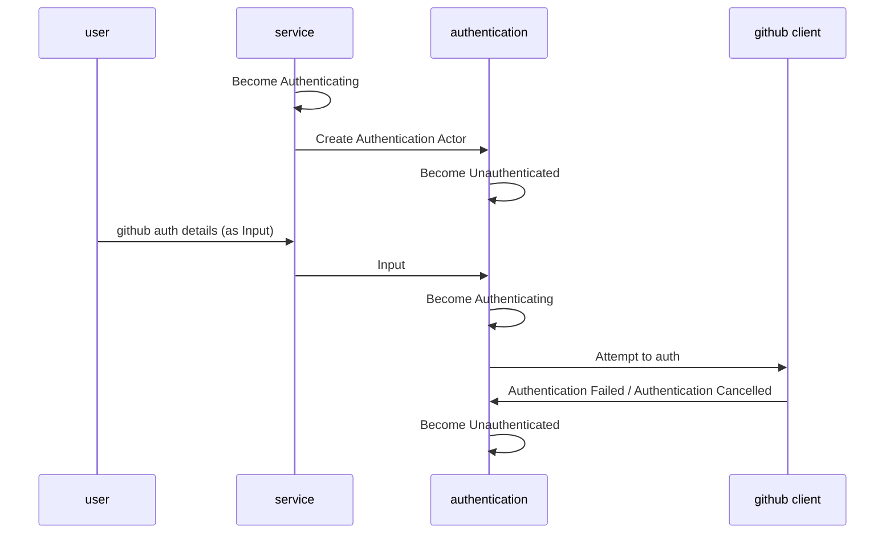
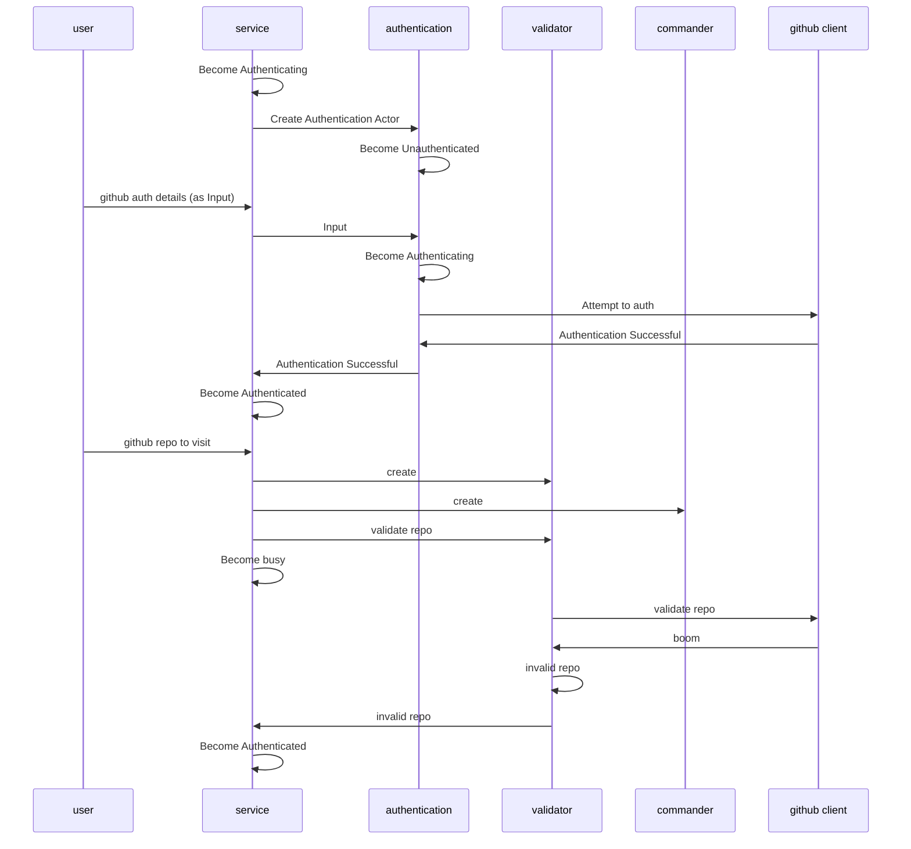
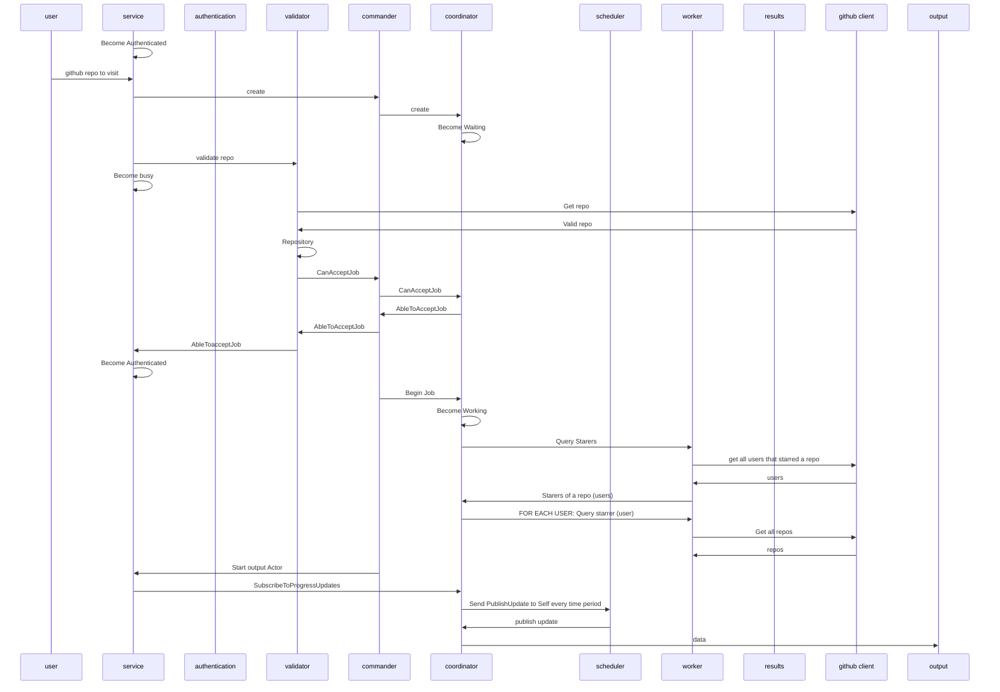

# Akka demonstration

This project is a rewrite of [the petabridge akka bootcamp](https://github.com/petabridge/akka-bootcamp)

I had to make some changes as this is a .net core project. 
So rather than use winforms I rewrote it to be console driven.

A few things got added such as logging.
Also ended up adding a service actor to orchestrate the parts - and pass input to the active actors using become

## Things to try

1. Try throwing an exception in the `Authenticated` handler in 
[GithubAuthenticationActor](./GithubAuthenticationActor.cs) - Notice how the supervisor restarts the actor and we simply get asked to log in again.
2.

## Authentication Failed

## Invalid Repo

## Processing a repo

# Afterlesson 1:

